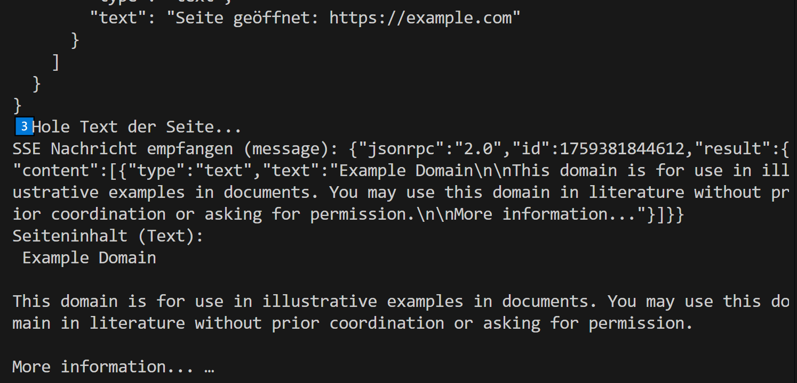
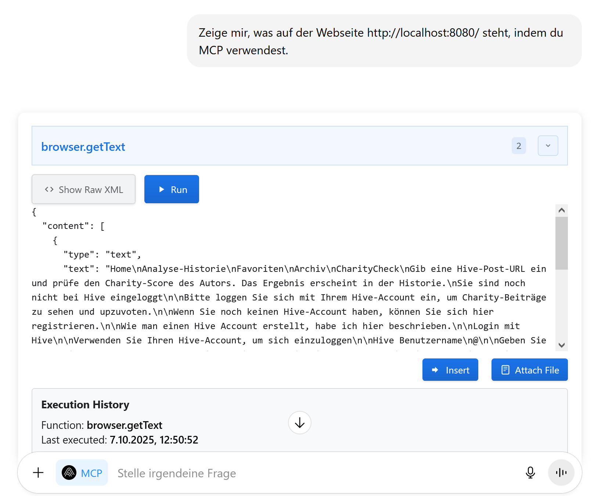
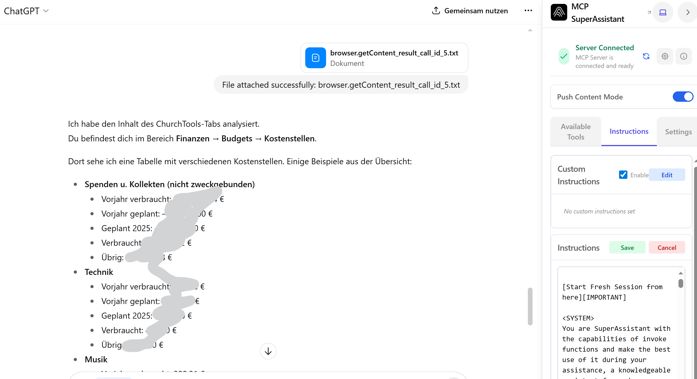
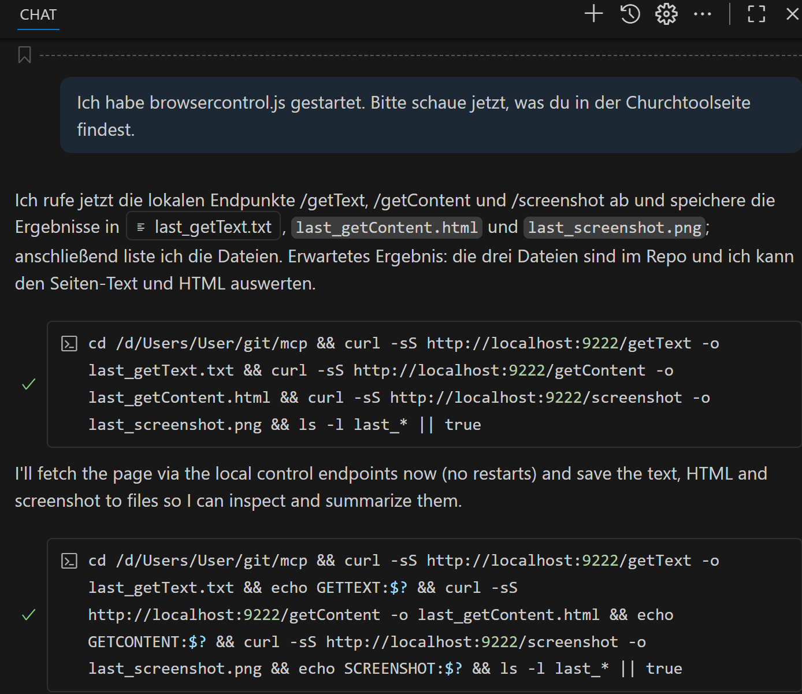
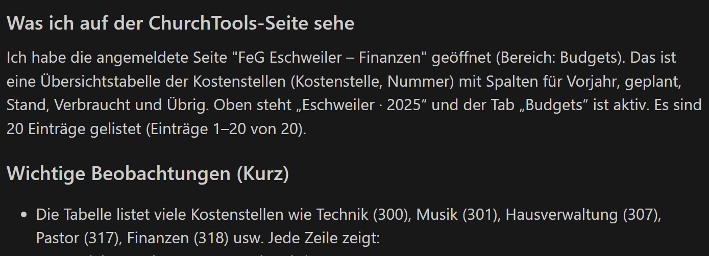
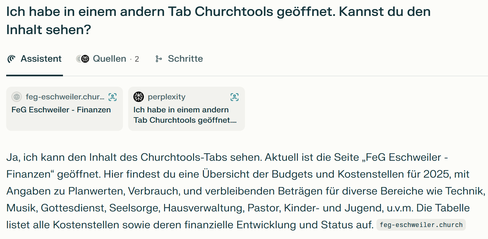

# Readme.md
Diese Dokumentation wurde erstellt von Achim Mertens.

Die von mir erstellten Scripte unterliegen keiner Lizenz und sind öffentlich verfügbar.


[Quelle](https://cdn.prod.website-files.com/603164e08678e20760ec256c/67b80eadeddc78d9b61c907f_MCP_quality_assurance.png)

# Das Model Context Protocol (MCP)

MCP (Model Context Protocol) ist eine standardisierte Schnittstelle, mit der Sprachmodelle auf externe Datenquellen, Tools und lokale Dateien zugreifen können – kontrolliert, sicher und lokal über einen Proxy.


Mein Ziel ist es, das Chatgpt & Co auf Webseiten zugreifen kann, auf die ich mich eingeloggt habe. Ich möchte z.B., dass ChatGPT die Fehlermeldungen sieht, die ich nur erhalte, wenn ich eingeloggt bin. Oder dass ChatGPT meine Bilanzen eines Berechnungstools sieht und auswertet.


Es gibt, wie auf der Skizze zu sehen ist, mehrere Wege, die nach Rom führen.

Ich habe dazu ein paar Scripte erstellt, die auf Basis von Javascript mir den MCPProxy und den MC-Server zur Verfügung stellen.

Die Wege über einen beliebigen Browser mit MCP Erweiterung, über VSCode mit dem Copiloten und über den neuen Perplexity Comet Browser habe ich im Folgenden beschrieben.


# Lokalen MCP-Proxy-Server einrichten und starten

Wir brauchen eine config.json Datei. Diese enthält die Konfiguration für den MCP-Zugriff. Sie definiert, was die KI lokal bei mir tun darf. In diesem Beispiel darf sie lesend und schreibend auf den Ordner "Brave" zugreifen, sowie meinen Browser benutzen.
Meine Config Datei sieht so aus:
```
{
  "mcpServers": {
    "filesystem": {
      "command": "npx",
      "args": [
        "-y",
        "@modelcontextprotocol/server-filesystem",
        "D:\\Users\\User\\git\\mcp\\brave"
      ]
    },
    "browser": {
      "command": "node",
      "args": [
        "D:\\Users\\User\\git\\mcp\\server-browser.js"
      ]
    }
  }
}
```


Ich starte dann den Proxy-Server über die DOS Konsole. Bei den meisten Systemen geht das mit folgendem Befehl (sofern Node.js installiert ist):


> npx @srbhptl39/mcp-superassistant-proxy@latest --config D:\Users\User\git\mcp\config.json

bzw.:
Starten in der Powershell:
PS D:\Users\User\git\mcp> .\startsupermcp.bat


Output:
```
[mcp-superassistant-proxy] Starting server filesystem: npx -y @modelcontextprotocol/server-filesystem D:/mcp/brave
Secure MCP Filesystem Server running on stdio
Allowed directories: [ 'D:\\mcp\\brave' ]
[mcp-superassistant-proxy] Connected to server: filesystem
[mcp-superassistant-proxy] Server filesystem has 12 tools
[mcp-superassistant-proxy] Successfully initialized server: filesystem
[mcp-superassistant-proxy] Config-to-SSE gateway ready
[mcp-superassistant-proxy] Listening on localhost:3006
[mcp-superassistant-proxy] SSE endpoint: http://localhost:3006/sse
[mcp-superassistant-proxy] POST messages: http://localhost:3006/message
```

# MCP Server für Browser Einrichten

Ich habe eine server-browser.js Datei erstellt. Ich habe sie initialisiert mit:

> npm init -y
npm install @modelcontextprotocol/sdk playwright

> npm install node-fetch eventsource

> npx playwright install

Wegen einer Fehlermeldung musste die package.json noch angepasst werden:

Add "type": "module" to D:\Users\User\git\mcp\package.json.
```
  ...
  "main": "mcp-browser-test.js",
  "type": "module",
  "scripts": {
  ...
```

MCP Server für Browser starten:
> node server-browser.js

# MCP Server und Proxy testen
Um zu sehen, ob die beiden Tools funktionieren, habe ich das mcp-browser-test.js Script erstellt. 
Es wird gestartet mit:

$ node mcp-browser-test.js

Das Tool testet den MCP-Proxy in einem Browser, indem es die Tools openPage und getText aufruft um die Webseite https://example.com zu öffnen und die Ergebnisse anzeigt. Es verwendet den SSE-Endpoint zum Empfangen von Nachrichten.
Voraussetzung: MCP Proxy und server-browser.js laufen und der Proxy ist über http://localhost:3006 erreichbar. So sieht ein erfolgreicher Testlauf aus:




# MCP im Browser aktivieren

Damit ChatGPT, Perplexity und Co. mit meinem Browser oder meiner Festplatte (oder weiteren Tools) kommunizieren können, brauchen wir ein Plugin. Hier beschreibe ich, wie ich den [MCP Super Assistant](brave://extensions/?id=kngiafgkdnlkgmefdafaibkibegkcaef) als Erweiterung für Brave installiert habe:


Voraussetzung für das Plugin ist, dass irgendwo ein MCP Server läuft. In meinem Fall ist es das lokal laufende Script server-browser.js. Es kann aber auch (mit einem anderen Plugin) ein MCP-Server sein, der irgendwo im Internet liegt. Dieser kann dann natürlich nicht die lokalen Ressourcen freigeben.

# MCP in ChatGPT nutzen
Sobald das Addon im Browser aktiv ist (und eine Kommunikation zum MCP Proxy hat), erkennen moderne KI Systeme dies und bieten einen "MCP-Knopf" unter dem Chatfenster an.

Wenn man darauf un dan "insert" klickt, wird ein Prompt bei ChatGPT hinzugefügt. Am Ende des Prompts gebe ich meinen eigentlichen Prompt-Text für meinen Fall ein:


Chatgpt greift jetzt über die Browsererweiterung auf meinen Proxy zu, der wiederum das Freigibt, was ich dort erlaubt habe, nämlich den Inhalt von D:\mcp\brave:


Es kann sogar eine Datei erstellen:


ChatGPT und Co sind jetzt in der Lage auch meinen Browser zu verwenden und zu sehen, was ich sehe (solange ich nicht eingeloggt bin):


# Auf eine private Webseite zugreifen

Das ist ja schon mal gut. Aber für viele Fälle reicht das nicht aus. Ich möchte auch nicht ChatGPT sagen: "Hier ist mein Passwort, logge dich mal ein!", sondern ich möchte, dass die KI genau das sieht, was ich sehe (nachdem ich mich eingeloggt habe). Dazu sehe ich drei Wege:
1. via normalen Browser und MCP
2. via Script
3. via KI Browser (Comet von Perplexity)

Ich beschreibe diese Wege im Folgenden:

## Via normalen Browser und MCP

Was ich ja vor Allem möchte ist, dass die KI das sieht, was ich auf meinem Browser sehe, auch dann, wenn ich irgendwo eingeloggt bin, wo die KI von alleine 
nicht hinkommen kann.

Ich habe dazu folgendes gemacht:
Ich habe den MCP Server gestartet:
> $ node server-browser.js

Und dann den MCP-Proxy:
> npx @srbhptl39/mcp-superassistant-proxy@latest --config D:\Users\User\git\mcp\config.json

Im Microsoft Edge Browser habe ich den MCP Superassistant aktiviert.

Wenn ich mit einer Chat-KI wie ChatGPT und MCP auf eine private Seite zugreifen will, muss ich erst die Cookies der Session zwischenspeichern. (Das habe ich einmalig geschafft mit irgend einem Addon, das ich jetzt nicht mehr wiederfinde)
Z.B. in cookies.json:
```
[
  {
    "name": "ChurchTools_ct_feg-eschweiler",
    "value": "6mulsk9tpaemcreh54kmj3upv1",
    "domain": "feg-eschweiler.church.tools",
    "path": "/",
    "expires": 1794382952.28379,
    "httpOnly": true,
    "secure": true,
    "sameSite": "None",
    "partitionKey": "https://church.tools",
    "_crHasCrossSiteAncestor": false
  }
] 
```
Diesen Inhalt muss ich dann an die KI weiterreichen:

Ich habe dann den Inhalt vom MCP Insert als Prompt ausgeführt:

Da drunter habe ich folgenden Prompt eingegeben:
```
User Interaction Starts here: Ich möchte dass du via MCP auf https://feg-eschweiler.church.tools/?q=finance#/budgets/costcenters mit meinem Account zugreifst. Bitte verwende dazu den schon geöffneten Tab im Browser. Bitte beschreibe, was du siehst.
```

Dann muss ich ihm mit "run" erlauben, das zu tun und mit "insert Text File", den gewonnenen Inhalt bei ChatGPT übergeben.

Danach konnte er die Finanzseite sehen und auswerten:



Wie erwähnt ist mir das einmalig gelungen. Leider habe ich es ohne weiteren Aufwand kein weiteres Mal hinbekommen. Ich stecke da auch keine weitere Energie rein, da die weiter unten genannten Alternativen interessanter für mich sind:

## Via Script
Ich habe mir ein Script erstellen lassen, welches als MCP Server dient und die Daten via VSCode und Copilot auslesen und auswerten kann. Ich starte den Server mit:

> node browser-control.js

Es erscheint ein Browser. Dort geht man in die gewünschte private Webseite. Nun kann man mit Copilot im Visual Studio Code den Inhalt abfragen:


Dieses Vorgehen hat den Vorteil, dass man mit weiteren Scripten die Ergebnisse direkt verarbeiten kann.

## Via Comet
Der Zugriff geht aber mit dem neuen Perplexity Browser. Das ist natürlich der komfortabelste Weg um die Web Inhalte mit Perplexity auswerten zu lassen.


# Fazit
Das Thema MCP ist relativ neu und das merkt man auch anhand der vorhandenen Dokumentation bzw. Erfahrung. Die KI konnte mir nur bedingt helfen meine Wünsche zu erfüllen. Der Weg über den lokalen MCP-Server, MCP Proxy und Browser mit MCP Erweiterung ist kompliziert und nicht ausgereift. Wie beschrieben habe ich es einmalig geschafft eine private Webseite damit auszulesen. Aber es kann keine Lösung sein, jedesmal die Cookies zwischenzuspeichern.
Der Weg über meine Scripte ist für mich persönlich der beste, da ich damit eine Reproduzierbarkeit der Auswertungen habe.
Der Weg über den KI Browser Comet ist der einfachste, aber auch ganz neu.

Ich denke, man sollte auch eine gewisse Vorsicht walten lassen, da die Versuchung groß ist, KI-Browsern wie Comet Zugriff auf viele private Webseiten, Mails, Kontakte,... zu geben. Angeblich werden die Inhalte zwar nicht zum Training ausgewertet, aber man weiß ja nie, was damit passiert, wenn sie erst einmal auf einem anderen externen Server liegen. Im schlimmsten Fall läuft eine KI Agent unkontroliert Amok mit meinen Daten und schreibt z.B. alle meine Kontakte in meinem Namen mit irgendeinem unschönen Inhalt an. 

Es bleibt auf jeden Fall spannend und ich habe mit meinen Scripten jetzt ein Werkzeug automatische Reports aus meinen Daten erstellen zu lassen.
Und ich kann Fehleranalysen von meinen lokal laufenden Webseiten mit Hilfe der KI erstellen, die diese Seiten jetzt so sehen kann, wie ich sie sehe.


# Links

https://www.youtube.com/watch?v=S_4VUJ-x8hE
(Autor: c'T 3003)


