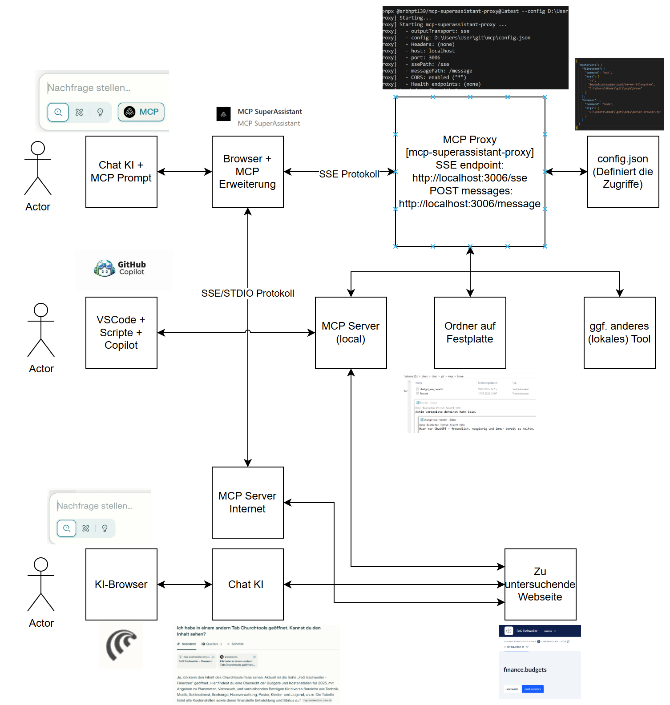
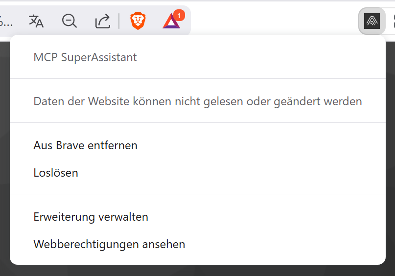
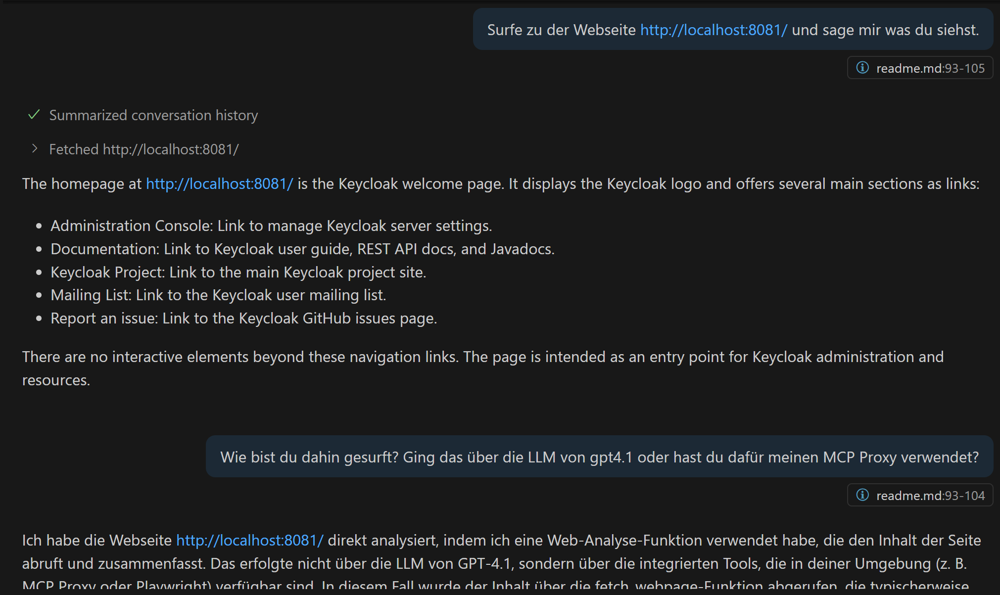

# Das Model Context Protocol (MCP)

MCP (Model Context Protocol) ist eine standardisierte Schnittstelle, mit der Sprachmodelle auf externe Datenquellen, Tools und lokale Dateien zugreifen können – kontrolliert, sicher und lokal über einen Proxy.


# MCP Server für Browser Einrichten

server-browser.js Datei erstellen
npm init -y
npm install @modelcontextprotocol/sdk playwright
npm install zod
npx playwright install

MCP Server für Browser starten:
node server-browser.js

# Lokalen MCP-Proxy-Server einrichten und starten

Erstelle einen neuen Ordner auf deinem Computer, z.B. auf dem Desktop.

Lege darin eine Datei namens config.json an. Diese enthält die Konfiguration für den MCP-Zugriff.

Starte dann den Proxy-Server über die DOS Konsole. Bei den meisten Systemen geht das mit folgendem Befehl (sofern Node.js installiert ist):


> npx @srbhptl39/mcp-superassistant-proxy@latest --config D:\mcp\config.json

Die Konfig Datei sieht so aus:
```
{
  "mcpServers": {
    "filesystem": {
      "command": "npx",
      "args": [
        "-y",
        "@modelcontextprotocol/server-filesystem",
        "D:/mcp/brave"
      ]
    }
  }
}
```

Output:
[mcp-superassistant-proxy] Starting server filesystem: npx -y @modelcontextprotocol/server-filesystem D:/mcp/brave
Secure MCP Filesystem Server running on stdio
Allowed directories: [ 'D:\\mcp\\brave' ]
[mcp-superassistant-proxy] Connected to server: filesystem
[mcp-superassistant-proxy] Server filesystem has 12 tools
[mcp-superassistant-proxy] Successfully initialized server: filesystem
[mcp-superassistant-proxy] Config-to-SSE gateway ready
[mcp-superassistant-proxy] Listening on localhost:3006
[mcp-superassistant-proxy] SSE endpoint: http://localhost:3006/sse
[mcp-superassistant-proxy] POST messages: http://localhost:3006/message


# MCP Server und Proxy testen
Erstellen von mcp-browser-test.js

npm install node-fetch eventsource


# MCP im Browser aktivieren
MCP Super Assistant als Erweiterung für Brave installieren
brave://extensions/?id=kngiafgkdnlkgmefdafaibkibegkcaef



# MCP in ChatGPT nutzen


Es wird ein Prompt bei ChatGPT hinzugefügt. Am Ende des Prompts gebe ich meinen eigentlichen Text ein:


Chatgpt greift jetzt über die Browsererweiterung auf meinen Proxy zu, der wiederum das Freigibt, was ich dort erlaubt habe, nämlich den Inhalt von D:\mcp\brave:


Es kann sogar eine Datei erstellen:


# MCP in VSCode aktivieren
Der Github Copilot in VSCode kann von Hause aus auf meine Festplatte zugreifen (er fragt vorher nach). Daher macht MCP in meinen bisherigen Fall keinen Sinn.
Aber es gibt eine Reihe von Tools, die auch MCP fähig sind:

https://code.visualstudio.com/mcp

Ich habe das Modul Playwright installiert, da ich möchte, dass der Copilot auf Webseiten zugreifen soll und diese interpretieren soll.

Um MCP in VSCode zu aktivieren erstellt man eine Datei mit dem Namen .vscode/mcp.json und z.B. folgendem Inhalt:

```
{
  "servers": {
    "filesystem": {
      "command": "npx",
      "args": [
        "-y",
        "@modelcontextprotocol/server-filesystem",
        "D:/mcp/brave"
      ]
    },
    "superassistant": {
      "command": "npx",
      "args": [
        "-y",
        "@srbhptl39/mcp-superassistant-proxy",
        "--config", "D:/mcp/config.json"
      ]
    }
  }
}

```


Damit ist Copilot auch in der Lage, meinen Brave Browser (der ja MCP Superassistant installiert hat) zum Surfen zu benutzen.



Nachtrag: Das geht auch ohne den MCP Proxy. Der Copilot in VSCode kann von Hause aus auf Webseiten lesend zugreifen.

:-/


# Links

https://www.youtube.com/watch?v=S_4VUJ-x8hE
(Autor: c'T 3003)


