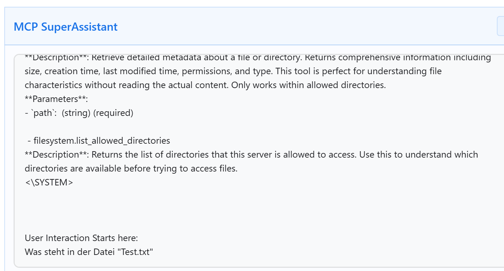

# Readme.md
Diese Dokumentation wurde erstellt von Achim Mertens
Der Code unterliegt keiner Lizenz und ist öffentlich verfügbar.

# Das Model Context Protocol (MCP)

MCP (Model Context Protocol) ist eine standardisierte Schnittstelle, mit der Sprachmodelle auf externe Datenquellen, Tools und lokale Dateien zugreifen können – kontrolliert, sicher und lokal über einen Proxy.


Mein Ziel ist es, das Chatgpt & Co auf Webseiten zugreifen kann, auf die ich mich eingeloggt habe. Ich möchte z.B., dass ChatGPT die Fehlermeldungen sieht, die ich nur erhalte, wenn ich eingeloggt bin. Oder dass ChatGPT meine Bilanzen eines Berechnungstools sieht und auswertet.

Ich habe dazu ein paar Scripte erstellt, die auf Basis von Javascript mir den MCPProxy und den MC-Server zur Verfügung stellen


# Lokalen MCP-Proxy-Server einrichten und starten

Wir brauchen eine config.json Datei. Diese enthält die Konfiguration für den MCP-Zugriff.
Meine Konfig Datei sieht so aus:
```
{
  "mcpServers": {
    "filesystem": {
      "command": "npx",
      "args": [
        "-y",
        "@modelcontextprotocol/server-filesystem",
        "D:\\Users\\User\\git\\mcp\\brave"
      ]
    },
    "browser": {
      "command": "node",
      "args": [
        "D:\\Users\\User\\git\\mcp\\server-browser.js"
      ]
    }
  }
}
```


Ich starte dann den Proxy-Server über die DOS Konsole. Bei den meisten Systemen geht das mit folgendem Befehl (sofern Node.js installiert ist):


> npx @srbhptl39/mcp-superassistant-proxy@latest --config D:\Users\User\git\mcp\config.json

bzw.:
Starten in der Powershell:
PS D:\Users\User\git\mcp> .\startsupermcp.bat


Output:
```
[mcp-superassistant-proxy] Starting server filesystem: npx -y @modelcontextprotocol/server-filesystem D:/mcp/brave
Secure MCP Filesystem Server running on stdio
Allowed directories: [ 'D:\\mcp\\brave' ]
[mcp-superassistant-proxy] Connected to server: filesystem
[mcp-superassistant-proxy] Server filesystem has 12 tools
[mcp-superassistant-proxy] Successfully initialized server: filesystem
[mcp-superassistant-proxy] Config-to-SSE gateway ready
[mcp-superassistant-proxy] Listening on localhost:3006
[mcp-superassistant-proxy] SSE endpoint: http://localhost:3006/sse
[mcp-superassistant-proxy] POST messages: http://localhost:3006/message
```

# MCP Server für Browser Einrichten

Ich habe eine server-browser.js Datei erstellt. Ich habe sie initialisiert mit:

> npm init -y
npm install @modelcontextprotocol/sdk playwright

> npm install node-fetch eventsource

> npx playwright install

Wegen eier Fehlermeldung musste die package.json noch angepasst werden:

Add "type": "module" to D:\Users\User\git\mcp\package.json.
```
  ...
  "main": "mcp-browser-test.js",
  "type": "module",
  "scripts": {
  ...
```

MCP Server für Browser starten:
> node server-browser.js

# MCP Server und Proxy testen
Um zu sehen, ob die beiden Tools funktionieren, habe ich das mcp-browser-test.js Script erstellt. 
Es wird gestartet mit:

$ node mcp-browser-test.js

Das Tool testet den MCP-Proxy in einem Browser, indem es die Tools openPage und getText aufruft und die Ergebnisse anzeigt. Es verwendet den SSE-Endpoint zum Empfangen von Nachrichten.
Voraussetzung: MCP Proxy und server-browser.js laufen und der Proxy ist über http://localhost:3006 erreichbar. So sieht ein erfolgreicher Testlauf aus:


# MCP im Browser aktivieren

Damit ChatGPT, Perplexity und Co mit meinem Browser kommunizieren können, brauchen wir ein Plugin. Hier beschreibe ich, wie ich den [MCP Super Assistant](brave://extensions/?id=kngiafgkdnlkgmefdafaibkibegkcaef) als Erweiterung für Brave installiert habe:


# MCP in ChatGPT nutzen
Sobald das Addon im Browser aktiv ist (und eine Kommunikation zum MCP Proxy hat), erkennen moderne KI Systeme dies und bieten einen "MCP-Knopf" unter dem Chatfenster an.

Wenn man darauf un dan "insert" klickt, wird ein Prompt bei ChatGPT hinzugefügt. Am Ende des Prompts gebe ich meinen eigentlichen Prompt-Text für meinen Fall ein:


Chatgpt greift jetzt über die Browsererweiterung auf meinen Proxy zu, der wiederum das Freigibt, was ich dort erlaubt habe, nämlich den Inhalt von D:\mcp\brave:


Es kann sogar eine Datei erstellen:


# Auf eine private Webseite zugreifen
Was ich ja vor Allem möchte ist, dass die KI dass sieht, was ich auf meinem Browser sehe, auch dann, wenn ich irgendwo eingeloggt bin, wo die KI von alleine 
nicht hinkommen kann.

Ich habe dazu folgendes gemacht:
Ich habe gestartet:
> $ node server-browser.js

> npx @srbhptl39/mcp-superassistant-proxy@latest --config D:\Users\User\git\mcp\config.json


Im Microsoft Edge Browser habe ich den MCP Superassistant aktiviert.

Ich habe dann den Inhalt vom MCP Insert als Prompt ausgeführt:

Da drunter habe ich folgenden Prompt eingegeben:
User Interaction Starts here: Ich möchte dass du auf https://feg-eschweiler.church.tools/?q=finance#/budgets/costcenters mit meinem Account zugreifst. Bitte verwende dazu den schon geöffneten Tab im Browser. Bitte beschreibe, was du siehst.

Dann muss ich ihm mit "run" erlauben, das zu tun und mit "insert Text File", den gewonnenen Inhalt bei ChatGPT übergeben.

Danach konnte er die Finanzseite sehen und auswerten (Jipiieeee):


# Links

https://www.youtube.com/watch?v=S_4VUJ-x8hE
(Autor: c'T 3003)


